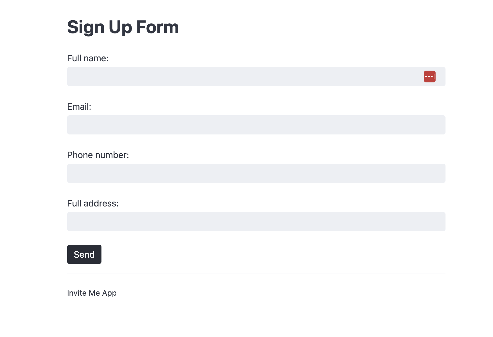

# Django with Celery and Redis
I created this for teaching Django, Redis, Celery tutorial


## Installation
- django
- redis
- python-dotenv
- celery


## Using Redis on Docker
```
docker run -p 6379:6379 --name local_redis redis
```

## Checking Celery 
```
celery -A inviteMe worker -l info
```

### Run
```
python manage.py runserver
```

### Result

Signup Form Page



One the form is submitted. You will get and email.


